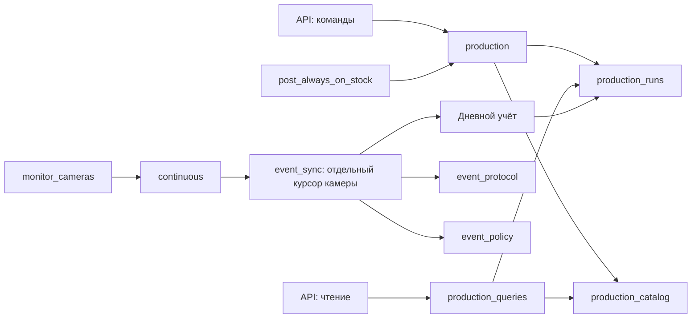

# Cameras: упрощение и масштабирование

## Анализ перед изменениями

Срез: `26cbc1f`. Контур состоит из Django API, PostgreSQL, отдельного
camera-monitor, worker складского прихода, внешнего AI-сервиса и go2rtc.
Frontend опрашивает runtime, дневные итоги и детализацию отдельно.

Ключевые цепочки:

- Отгрузка: резерв камеры/заказа → удалённый start → подтверждение сессии →
  running → подтверждённый stop → завершение погрузки. Неопределённый ответ
  start и отложенная очистка являются полноценными состояниями.
- Непрерывный подсчёт: сохранённые роли → reconcile → журнал `/events` →
  атомарная страница → дневные суммы и последовательность цветов → курсор.
- Склад: интервалы производственной смены до 19:00 → подтверждение дочитанного
  журнала → партия → складские проводки. Повтор не должен дублировать приход.

PostgreSQL остаётся источником истины. Блокировка курсора сериализует импорт и
закрытие смены одной камеры; разные камеры имеют независимые курсоры. HTTP
журнала выполняется до транзакции. Эти свойства сохраняются.

## Подтверждённые проблемы

### [HIGH] S01. Чтение production меняет интервалы других камер

**Файлы:** `backend/apps/cameras/production.py`, `api_views/operations.py`.

**Что происходит:** `production_payload` вызывает `close_stale_runs`; функция
блокирует все открытые AI247-интервалы, затем по одному закрывает устаревшие.
Каждый просмотр и polling участвуют в глобальном жизненном цикле записи.

**Сценарий:** несколько операторов обновляют карточки, конкурируя с импортом
за блокировки камер, которые они даже не открывали.

**Исправление:** read-only проекция статуса интервала; реальное закрытие у
фонового worker. Выбираются только устаревшие строки с `SKIP LOCKED`, затем
выполняется один условный UPDATE. Занятые импортом строки остаются следующему
циклу; закрытие не блокирует активную камеру и не меняет порядок её блокировок.

**Риск изменения:** Medium.

### [MEDIUM] S02. Prefetch партий фактически обходится: N+1

**Файлы:** `backend/apps/cameras/production.py`, `_batch_payload`.

**Что происходит:** запрос загружает `items__product` и `items__receipt`, но
сериализатор повторно вызывает `row.items.select_related(...)`. Этот QuerySet
не использует подготовленный related cache. До 31 дополнительного запроса
выполняется при каждом polling.

**Исправление:** единый Prefetch с нужными связями; сериализатор читает `.all()`.
Проверка числа SQL при росте количества партий.

**Риск изменения:** Low.

### [MEDIUM] S03. События страницы повторяют одни и те же запросы

**Файлы:** `backend/apps/cameras/event_sync.py`.

**Что происходит:** до 500 событий страницы отдельно проверяют партию смены
(часто дважды), архивный день и наличие строки журнала. Курсор уже заблокирован
на всю страницу, но эта гарантия не используется для пакетного чтения.

**Исправление:** загрузить существующие строки и неизменяемые в рамках
блокировки страницы состояния периодов пакетно; вставлять новые строки
журнала пакетно. Последовательность цветов и транзакция всей страницы остаются
едиными. Не применять `ignore_conflicts`, скрывающий расходящиеся события.

**Риск изменения:** High; обязательны replay, rollback, закрытые смены,
bootstrap и конкурентные импорт/закрытие.

### [MEDIUM] S04. Границы ответственности production и event_sync не видны

**Файлы:** `production.py` (1640 строк), `event_sync.py` (835 строк).

**Что происходит:** графики и DTO находятся вместе со складскими проводками;
правила допустимости событий смешаны с транспортным форматом и записью БД.

**Исправление:** отделить read model и интервалы от команд складского учёта;
выделить именованное решение о назначении события. Сохранить публичные
импорты/HTTP-контракты. Без новых сетевых сервисов и универсальных repository.

**Риск изменения:** Medium.

### [MEDIUM] S05. Один медленный журнал задерживает следующие камеры

**Файлы:** `continuous.py`, `_record_counts`.

**Что происходит:** камеры импортируются последовательно, до четырёх страниц
на каждую. При расширении парка растёт интервал между обновлениями.

**Исправление:** рассмотреть ограниченный параллелизм по независимым камерам
после снижения SQL-нагрузки. Не распараллеливать страницы одной камеры. У
каждого worker должен быть собственный жизненный цикл DB-соединения.

**Риск изменения:** Medium; требуется проверка изоляции ошибок и ресурсов.

## Порядок работы и ограничения

1. Воспроизвести побочные эффекты GET и измерить SQL.
2. Упростить production, исправить чтение и N+1.
3. Оптимизировать страницу импорта с сохранением транзакционных гарантий.
4. Проверить ограниченный параллелизм и поведение при отказах.
5. Прогнать cameras и связанные складские/отгрузочные сценарии, полный CI.

Более широкое масштабирование на несколько camera-PC требует явной модели
владения устройствами: текущий протокол и настройки указывают на один upstream.
Количество реальных доступных camera-PC и требуемую нагрузку из кода определить
нельзя. Старый snapshot-протокол пока сохраняется только для явного 404;
неопределённая ошибка журнала не разрешает fallback и двойной учёт.

## Реализованная структура

| Модуль | Ответственность |
|---|---|
| `production.py` | Изменение привязок и коррекций, атомарный складской приход; существующие точки входа |
| `production_catalog.py` | Общие правила выбора склада и складской карточки |
| `production_runs.py` | Границы смены, последовательность цветовых интервалов и их закрытие |
| `production_queries.py` | Read-only DTO, детализация и сглаживание для отображения |
| `event_protocol.py` | Проверка входного JSON, DTO события и нормализация классификации |
| `event_policy.py` | Явное решение: аналитика, производство, bootstrap или только журнал |
| `event_sync.py` | Блокировки, атомарная страница и продвижение курсора |
| `continuous.py` | Согласование настроек и ограниченный пул независимых камер |

`production.py` сокращён с 1640 до примерно 760 строк. Код разнесён по
ответственности, а не по произвольной длине файлов; сетевых сервисов, новых
зависимостей и миграций не добавлено. Импорты старых точек входа сохранены.

В `production_queries` вызовы из `production_runs` вычисляют календарные
границы/статус и читают суммы; мутации интервалов оттуда не вызываются.

## Измеримый результат

Измерения через `CaptureQueriesContext` на локальном PostgreSQL, одинаковые
данные до/после. Это число SQL-запросов, не обещание такой же разницы в latency.

| Сценарий | До | После |
|---|---:|---:|
| Production: 1 партия с позицией | 19 SQL | 13 SQL |
| Production: 31 партия с позицией | 49 SQL | 13 SQL |
| Импорт 20 событий одного цвета | 271 SQL | 135 SQL |
| Обращения к таблице imported events в этой странице | 40 | 2 |
| Проверки партии смены в этой странице | 40 | 1 |

Дополнительно убрана сортировка по `started_at` из `DISTINCT color`:
дефолтная сортировка модели ранее включала время в DISTINCT и возвращала
множество одинаковых цветов для последующего Python-set.

Параллелизм импорта задаёт `CAMERA_EVENT_SYNC_WORKERS`, диапазон 1–8,
по умолчанию 2. Значение 1 сохраняет последовательный режим. Один worker
обрабатывает страницы одной камеры по очереди. Соединения Django закрываются
в `finally`; одинаковая камера в списке не запускается дважды. Ошибка сети
сохраняется в курсоре, неожиданный сбой также помечается и затем поднимается
после завершения остальных workers.

## Гарантии и проверки

- Страница, её производственные/дневные проекции и курсор коммитятся вместе.
  Ошибка пакетной вставки журнала откатывает уже выполненные изменения.
- Два настоящих PostgreSQL-импортера одного журнала учитывают страницу один
  раз; проигравший получает уже продвинутый курсор.
- Закрытие интервалов проходит мимо занятой камеры, закрывает другую и
  сохраняет обновление `last_counted_at` конкурентного импортера.
- Сетевая и неожиданная ошибки одной камеры не отменяют коммит здоровой.
  Проверено фактическое закрытие соединений потоков после успеха и ошибок.
- Существующие сценарии replay, изменённого события, bootstrap, позднего
  события закрытой смены, архивного дня, возврата snapshot и warehouse retry
  проверяются прежним набором cameras-тестов.
- `makemigrations --check --dry-run`: изменений схемы нет.

Финальная локальная проверка: **2143 backend-теста и 3 subtests** прошли на
новой изолированной PostgreSQL-базе (`pytest -q --create-db`, 197 секунд).
Старая `--reuse-db` база после транзакционных тестов не содержала миграционных
справочников; её два сбоя в permissions/departments не воспроизвелись в чистом
полном прогоне. Исходные проверки не ослаблялись.

Проверены также максимальная страница в 500 событий (3015 SQL, из них только
2 обращения к журналу и 1 к партиям), статические проверки Ruff F/I,
`git diff --check` и **37 тестов deploy/backup**. В тестовых настройках обычные
TestCase используют один worker, потому что их незакоммиченные данные принадлежат
главному соединению; отдельные `transaction=True` тесты запускают настоящий
пул из двух потоков с независимыми соединениями.

## Следующие границы масштабирования

- Полный список продукции всё ещё часть совместимого production DTO.
  При большом каталоге следующий шаг — отдельная версия справочника и
  облегчённый polling-контракт с одновременным обновлением frontend.
- Дневные суммы и последовательность интервалов пока обновляются по событию.
  Вложенные транзакции и блокировки не удалялись ради красивой цифры SQL.
  Их пакетирование требует отдельной проверки границ дня/цвета и поздних событий.
- Несколько monitor-копий не дублируют учёт благодаря курсору, но могут
  дублировать HTTP-чтение. Для большого парка нужен lease/распределение камер
  между monitor-процессами; увеличение реплик само по себе не является шардированием.
- `counting.start/stop` сохраняют текущий протокол владения удалённой сессией.
  Разрыв блокировки БД и удалённой команды требует fencing/versioned-команд
  на camera-PC; локальным переносом функций это безопасно не решается.
- Предел FPS, задержки на реальном потоке и число камер на одном GPU этим
  прогоном не измерялись. Нагрузочные цифры выше относятся к CRM/PostgreSQL.

После выкладки вручную проверить живое увеличение счётчика, смену цвета,
детализацию дня, завершение отгрузки и очередное автоматическое закрытие
производственной смены. Для расширения парка увеличивать workers постепенно,
наблюдая отставание event cursor, БД и загрузку camera-PC.
